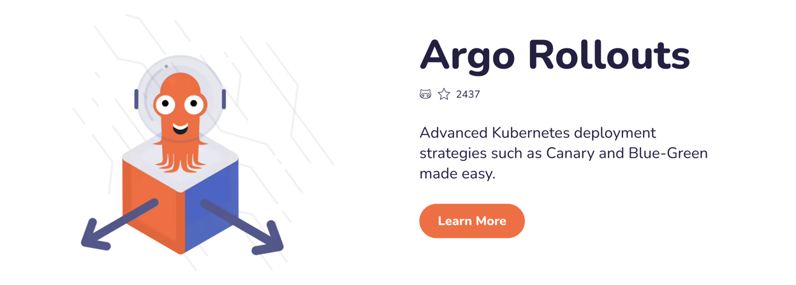

# Introduction

I attended KubeCon + CloudNativeCon Europe 2024 at Paris, France. Thanks to Zapier
for sponsoring me to attend this conference. It was a great week of learning
and networking at KubeCon. I caught up with the latest trends in Platform Engineering,
upstream projects and got a chance to connect with upstream contributors.

# Highlights

## Platform Engineering patterns
Apart from AI, one of the most popular tracks in KubeCon EU 2024 was Platform Engineering.
Many companies and organizations shared their platform stories, pitfalls, and recommendations.
Here are some key takeaways.

- The platform should be built as a product
- Compliance checks should be done at the point of change
- No developer should have direct access to the cloud
- The platform should be cloud-agnostic
- Low-level details like IAM policy, role, etc. should be abstracted away from developers.
- New tools & frameworks are emerging in the community to help build platforms, e.g., CNOE, Crossplane, etc.

The track also highlighted the steps to build a platform

- User documentation
- Adoption and partnership
- Platform as a product
- Customer feedback

There's also this platform engineering [working group](https://tag-app-delivery.cncf.io/es/wgs/platforms/) from CNCF. It is working to standardize patterns for developing platforms. This working group has also released a [wihtepaper](https://tag-app-delivery.cncf.io/es/wgs/platforms/) on Platforms.

## CNOE Framework
CNOE(Cloud Native Operational Excellence) is a framework developed around open-source cloud-native projects to assist companies in building their internal developer tooling. It aims to help platform engineers build their IDP platforms faster and more securely, with best practices integrated. CNOE prioritizes open-source technologies, community-driven decisions, and offers guidance on technology choices for optimal cloud efficiencies.

Key tenets include prioritizing open-source tech, community-driven decision-making, suggesting tools over practices, relying on Kubernetes, and offering standardized yet customizable infrastructure.

Read more about CNOE Framework [here](https://cnoe.io/docs/intro).

## Crossplane
Crossplane is an open source Kubernetes extension that transforms a Kubernetes cluster into a universal control plane.

With Crossplane, platform teams can create new abstractions and custom APIs with the full power of Kubernetes policies, namespaces, role based access controls and more. Crossplane brings all your non-Kubernetes resources under one roof.

Custom APIs, created by platform teams, allow security and compliance enforcement across resources or clouds, without exposing any complexity to the developers. A single API call can create multiple resources, in multiple clouds and use Kubernetes as the control plane for everything.

With Crossplane installed in a Kubernetes cluster, users only communicate with Kubernetes using declarative yamls. Crossplane manages the communication to external resources like AWS, Azure or Google Cloud.


Read more about Crossplane [here](https://docs.crossplane.io/v1.15/).

## K8GB


K8GB, short for Kubernetes Global Balancer, is a tool designed to address the challenge of global load balancing within Kubernetes clusters. It enables efficient distribution of traffic across multiple regions, allowing organizations to optimize performance and reliability for their services worldwide. K8GB provides a solution for managing traffic routing and load balancing across geographically distributed Kubernetes deployments, making it easier to scale applications and ensure high availability for users across different regions.

k8gb focuses on load balancing traffic across geographically dispersed Kubernetes clusters using multiple load balancing strategies to meet requirements such as region failover for high availability.

Read more about K8GB here.

## Argo CD & Rollouts

### ArgoCD


ArgoCD serves as the backbone of our deployment process at Zapier, orchestrating the rollout of our services across Kubernetes clusters. While we've fine-tuned our implementation of ArgoCD to suit our needs, insights from the ArgoCD upstream community have illuminated further avenues for optimization. Specifically, we've identified two key areas for potential enhancement.

- Run separate ArgoCD instances for different environments, like staging, production, tooling, etc.
- Limit the number of resources managed by an ArgoCD application.

However, the Argo upstream mentioned that the main reason end users refrain from having multiple ArgoCD instances is because of management overhead. Codefresh offers a managed ArgoCD service that adds a number of improvements on top of Open Source ArgoCD and solves a number of problems we have been thinking of solving at Zapier.

- Managing multiple ArgoCD clusters with ease
- Allow deploying Argo applications to environments consisting of multiple k8s clusters
- Allow migrating applications via UI across environments. Any changes in the UI get committed to git
- Create deployment pipelines on the fly from UI, again committed to git
- More user-friendly and faster UI

It will be worthwhile to explore Codefresh’s ArgoCD or similar managed ArgoCD services to find out what they have to offer.

### Argo Rollouts




Argo Rollouts is a Kubernetes controller and set of CRDs that provide advanced deployment capabilities such as blue-green, canary, canary analysis, experimentation, and progressive delivery features to Kubernetes.

Argo Rollouts (optionally) integrates with ingress controllers and service meshes, leveraging their traffic shaping abilities to gradually shift traffic to the new version during an update. Additionally, Rollouts can query and interpret metrics from various providers to verify key KPIs and drive automated promotion or rollback during an update.

Read more about Argo Rollouts here.
Try Argo Rollouts using this workshop demo.

## llmnetes.dev
LLMNETES, a Kubernetes controller designed to simplify cluster management with a natural language interface. Powered by Large Language Models (LLM).

Whether it's creating deployments, deleting pods, or triggering chaos experiments, LLMNETES understands and tries to execute your commands efficiently. It currently supports multiple LLM backends, including OpenAI's GPT-3 and a local model trained on a dataset. Additionally, users can integrate their own LLM backend by implementing the provided LLM interface.

llmnetes can be used to trigger chaos experiments. For example, to kill a pod in the default namespace, you can deploy the following manifest:

```
apiVersion: llmnetes.dev/v1alpha1
kind: ChaosSimulation
metadata:
  name: chaos-simulation-cr
spec:
  level: 10
  command: break my cluster networking layer (or at least try to)
```

Read more about llmnetes [here](https://github.com/llmnetes/llmnetes).

## Cast AI


CAST AI is an all-in-one platform for Kubernetes automation, optimization, and cost management. It abstracts layers of provider-specific technical complexity, so you can manage Kubernetes operations on all three major cloud providers with ease.

The platform comes with cost monitoring for real-time and longer-period cost reports at the cluster, namespace, and workload level. It also offers cost optimization suggestions and automatic optimization using autoscaling, spot instance automation, bin packing, and other features.

This is a SaaS product making high cost saving commitments at competitive pricing and people at KubeCon gave good feedback about this product.

## Karmada


Karmada (Kubernetes Armada), https://karmada.io/, is a Kubernetes management system that enables you to run your cloud-native applications across multiple Kubernetes clusters and clouds, with no changes to your applications. By using Kubernetes-native APIs and providing advanced scheduling capabilities, Karmada enables truly open, multi-cloud Kubernetes. Karmada aims to provide turnkey automation for multi-cluster application management in multi-cloud and hybrid cloud scenarios, with key features such as centralized multi-cloud management, high availability, failure recovery, and traffic scheduling.

Learn more about Karmada here.

## KubeDB
KubeDB  https://kubedb.com/ allows users to run production-grade databases on Kubernetes. KubeDB has been successfully adopted by many organizations (big and small) to run production-grade DBs in private clouds and internal infrastructure and has an AWS RDS-like experience. Plus, it costs way less than RDS.


# Community

As always, it's great to meet friends from the community in a conference like KubeCon.
It was great to connect to CNCF contributors, mentors and users and learn from them.


# Conclusion

I came back from KubeCon EU 2024, charged up to get more active in the CNCF community. I plan
to start contributing to a Kubernetes/CNCF project this year, and also share the knowledge I gained
operating Kubernetes at scale at Zapier.